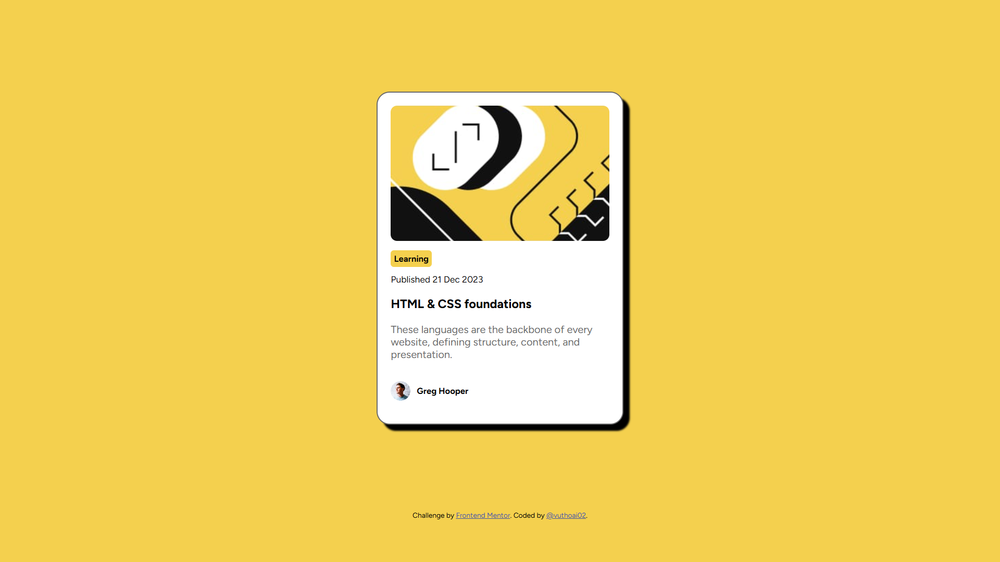
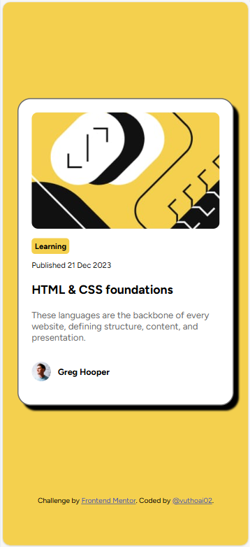

# Frontend Mentor - Blog preview card solution

This is a solution to the [Blog preview card challenge on Frontend Mentor](https://www.frontendmentor.io/challenges/blog-preview-card-ckPaj01IcS). Frontend Mentor challenges help you improve your coding skills by building realistic projects. 

## Table of contents

- [Overview](#overview)
  - [The challenge](#the-challenge)
  - [Screenshot](#screenshot)
  - [Links](#links)
- [My process](#my-process)
  - [Built with](#built-with)
  - [What I learned](#what-i-learned)
  - [Continued development](#continued-development)
  - [Useful resources](#useful-resources)
- [Author](#author)
- [Acknowledgments](#acknowledgments)

## Overview

### The challenge

Users should be able to:

- See hover and focus states for all interactive elements on the page

### Screenshot

### Links

- Solution URL: [Add solution URL here](https://your-solution-url.com)
- Live Site URL: [Add live site URL here](https://your-live-site-url.com)

## My process

### Built with

- Semantic HTML5 markup
- CSS custom properties
- Flexbox
- CSS Grid
- Mobile-first workflow

### What I learned
- Card Layout Design:
The interface uses a card layout to display the title, publication date, article type (learning), and author.
You can learn how to use HTML tags like 
, , <h2>, 
, , and <footer> to organize content in a structured way.
- Using CSS for Layout and Styling:
Shadow Effect: The subtle shadow makes the card stand out from the background. You can learn how to use the box-shadow property to create this effect.
Border Radius: The card corners are rounded to give a softer appearance. The border-radius property can be used for this purpose.
Padding & Margin: Learn how to use padding and margin to adjust the spacing between elements within the card.
Colors and Fonts: The interface uses contrasting colors and easy-to-read fonts. You can learn how to coordinate colors and choose appropriate fonts.
- Images and Icons:
Images within the card help create a focal point and relate to the content of the article. You can learn how to insert and align images within the card.
- Typography:
Different font weights, styles, and sizes are used to highlight various parts of the content. You can learn how to use the font-weight, font-size, and line-height properties.
- Responsiveness:
This simple interface can be optimized for different screen sizes, allowing you to learn how to make a design responsive.

### Continued development
I will learn more about complex interfaces, more effective methods for building interfaces, and the application of libraries in projects.

### Useful resources

## Author
- Frontend Mentor - [@vuthoai02](https://www.frontendmentor.io/profile/vuthoai02)

## Acknowledgments
- Card Layout Design
- CSS styling
- Responsiveness
